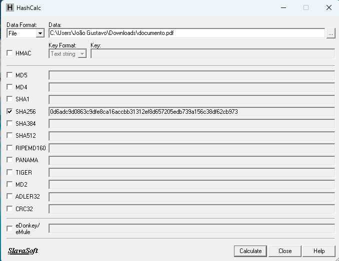
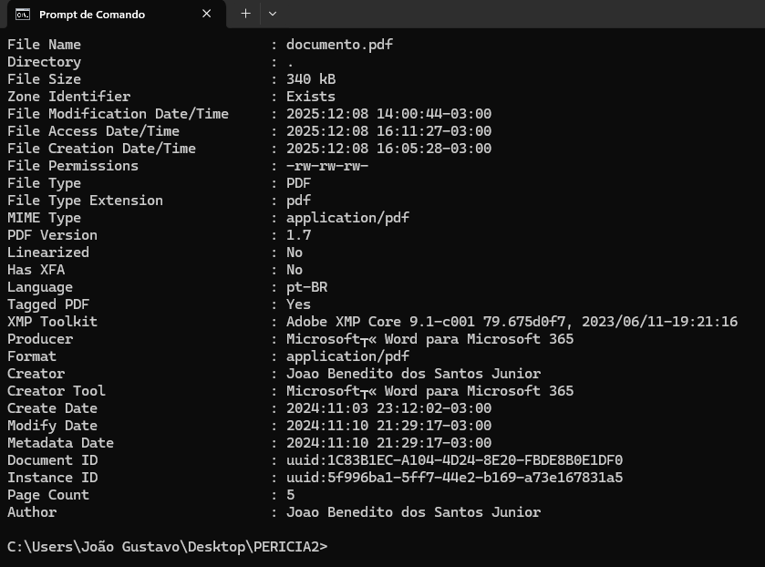
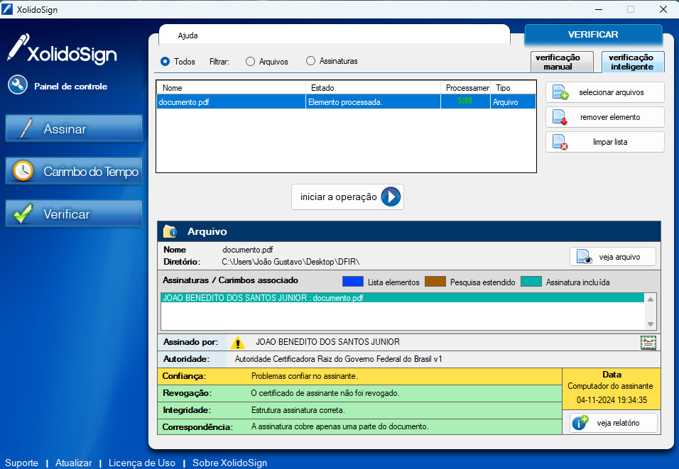
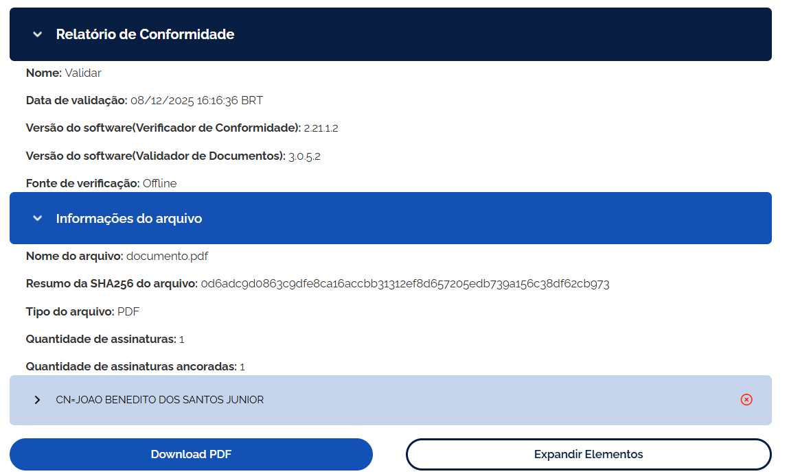

# 🔒 Laudo Pericial 1: Análise de Integridade e Autenticidade de Assinatura Digital

## 🎯 Objetivo da Perícia
O trabalho pericial teve como objetivo determinar a **autenticidade** (quem assinou?) e **integridade** (houve alterações?) do arquivo `documento.pdf`, com foco na validação da assinatura digital após questionamento da parte Autora.

---

## 🔬 Metodologia e Evidências Técnicas

O trabalho seguiu o rigor científico da Computação Forense e a Norma **ABNT ISO/IEC 27037:2013**, garantindo a cadeia de custódia da evidência digital.

### Preservação e Verificação de Integridade
* O código HASH SHA-256 de Cadeia de Custódia foi calculado imediatamente com a ferramenta **HashCalc**.
* **HASH SHA-256 da Evidência:** `0d6adc9d0863c9dfe8ca16accbb31312ef8d657205edb739a156c38df62cb973`. 

### Análise de Metadados e Temporal
* A ferramenta **ExifTool** foi utilizada para extrair metadados ocultos, como software de criação, autor e *timestamps* de modificação e criação. 
* **Metadados:** Foi identificado que o documento foi criado com o **Microsoft Word para Microsoft 365** pelo autor "Joao Benedito dos Santos Junior". 

* **Carimbo do Tempo (Timestamp):** A data exata da aposição da assinatura foi extraída pela ferramenta **XolidoSign**: `04/11/2024 19:34:35-0300`. 

### Validação Oficial
* O arquivo com a assinatura digital foi submetido ao validador oficial do Governo Federal, o **validar.iti.gov.br**, para verificar sua validade jurídica perante a ICP-Brasil. 

---

## ⚖️ Conclusão Pericial: Quebra de Integridade e Adulteração

Em cumprimento ao Artigo 473 do CPC, o Perito concluiu tecnicamente que:

* **Identificação do Signatário:** A assinatura foi aposta pelo titular **JOAO BENEDITO DOS SANTOS JUNIOR** em **04/11/2024**.
* **Quebra de Integridade:** O documento foi submetido à validação oficial no portal do ITI, o qual **REPROVOU** a assinatura digital.
* **Motivo da Adulteração:** A razão formal da reprovação é a comprovação de que o **"Documento foi modificado após a assinatura"**.
* **Resposta ao Quesito 5:** **SIM**, há sinais de edição do arquivo após a inserção da assinatura digital.
* **Resultado Final (Quesito 6):** Devido à violação da integridade, a assinatura é considerada **inválida** perante a ICP-Brasil.
