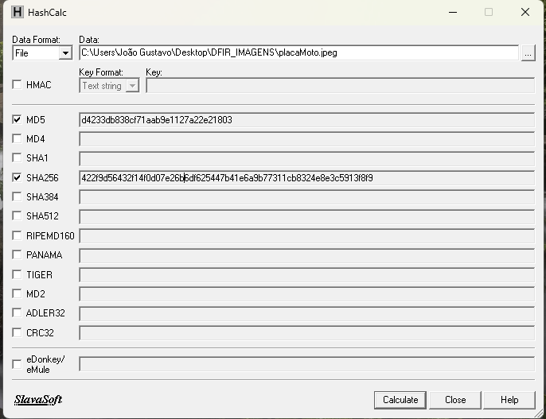
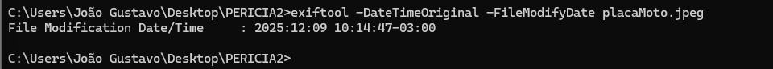
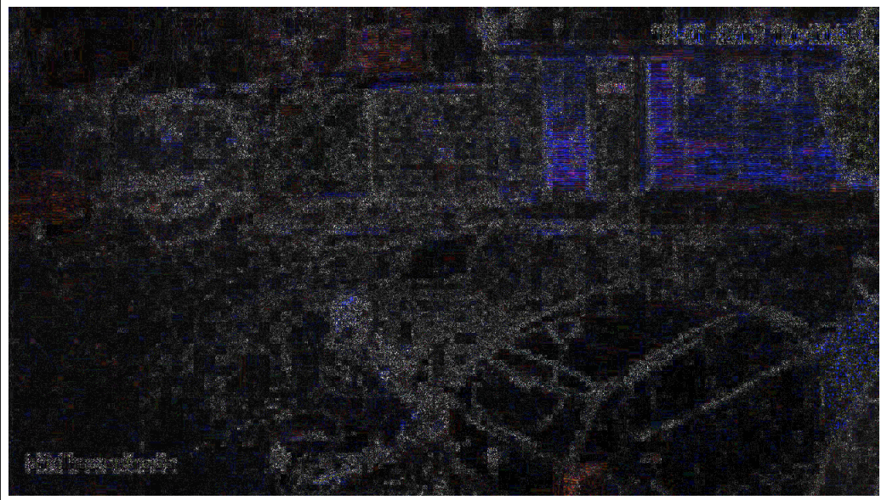
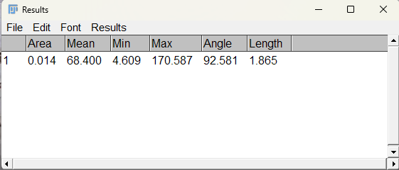

# 📸 Laudo Pericial 2: Análise Forense em Imagem Digital (placaMoto.jpeg)

## 🎯 Objetivo da Perícia
O trabalho pericial teve como objetivo a **análise forense do arquivo digital** `placaMoto.jpeg`, visando responder aos quesitos apresentados pela parte Autora, com foco na integridade, tempo de captura, extração de informações visuais (placa) e estimativa de altura do condutor.

---

## 🔬 Metodologia e Evidências Técnicas

O trabalho pericial seguiu as diretrizes do DFIR (Digital Forensics and Incident Response) e a Norma **ABNT ISO/IEC 27037:2013**, que estabelece padrões para a preservação da cadeia de custódia.

### Preservação e Verificação de Integridade
* **Objeto:** O material examinado é o arquivo de imagem digital em formato JPEG, denominado `placaMoto.jpeg`.
* **HASHs de Integridade:** A integridade do arquivo é comprovada pelas HASHs calculadas com o **HashCalc**.
    * **MD5:** `d4233db838cf71eab9e1127a22e21803`.
    * **SHA-256:** `422f9d56432f14f0d07e26b6df625447b41e6a9b77311cb8324e8e3c5913f8f9`.

### Análise de Metadados e Temporal
* **Extração de Metadados:** Utilização do **ExifTool** para obtenção de dados estruturais.
* **Timestamp Original:** O campo `DateTimeOriginal` estava **ausente**. A data mais confiável é o timestamp embutido na imagem, indicando a captura às **10:40:39 de 12-01-2017**.

### Análise de Adulteração (ELA)
* **Verificação da Integridade:** Utilização da ferramenta **Forensically** e análise **ELA** (Error Level Analysis).
* **Conclusão Técnica:** Não foram encontrados sinais técnicos de adulteração. A análise ELA revelou um **padrão de compressão uniforme**, confirmando que o arquivo é um *snapshot* de vídeo sem manipulação posterior.

---

## ⚖️ Conclusão Pericial: Resultados e Respostas aos Quesitos

### Resultados da Análise de Conteúdo

* **Quesito 9 (Placa):** **NÃO foi possível identificar a placa da motocicleta de forma conclusiva**. A resolução e o nível de ruído não permitiram a legibilidade inequívoca dos caracteres após o processamento de imagem.
* **Quesito 11 (Altura):** **SIM**, foi possível estimar a altura do condutor.
    * **Processamento e Medição:** Utilizando o **ImageJ/Fiji** e calibração de escala.
    * **Altura Estimada:** A altura estimada do condutor é de **1,87 metros** (Valor exato: 1,865 m).

### Conclusão Final
A perícia permitiu estimar a altura do condutor em **1,87 m** e confirmou que a imagem é um *snapshot* de sistema de vigilância (DVR). Contudo, não foi possível identificar a placa da motocicleta (Quesito 9) devido à baixa qualidade da imagem.
